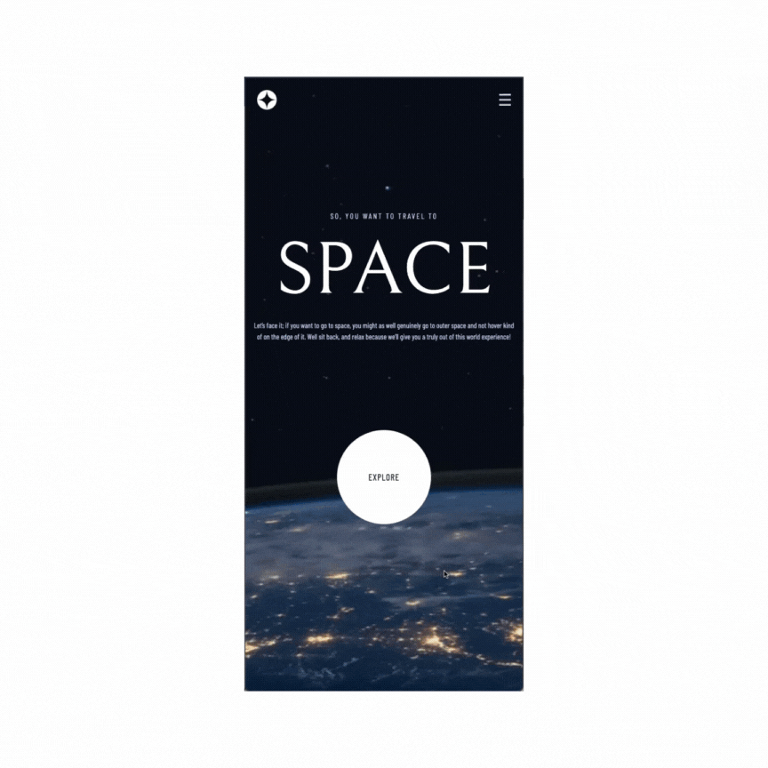
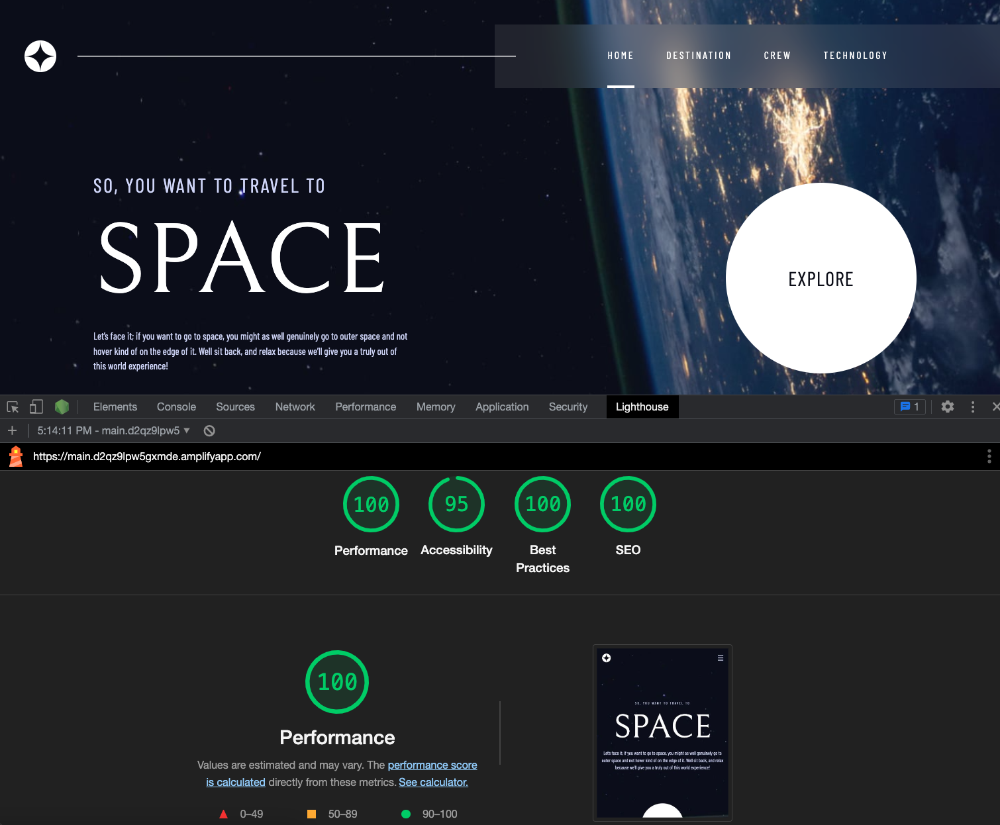

# Space Tourism

## Table of contents

- [Overview](#overview)
  - [The challenge](#the-challenge)
  - [Screenshot](#screenshot)
  - [Links](#links)
- [My process](#my-process)
  - [Built with](#built-with)
- [Author](#author)

## Overview
This is a challenge on [Frontend Mentor](https://www.frontendmentor.io/) to help you improve your coding skills by building realistic projects. It is an exciting project to build a responsive website that takes you on a virtual tour of outer space. It was all about creating an immersive experience that transports users to the wonders beyond.

### The challenge

Users should be able to:

- View the optimal layout for each of the website's pages depending on their device's screen size
- See hover states for all interactive elements on the page
- View each page and be able to toggle between the tabs to see new information

### Screenshot

### Links

- Live Site URL: [https://main.d2qz9lpw5gxmde.amplifyapp.com/](https://main.d2qz9lpw5gxmde.amplifyapp.com/)

## My process

### Built with

- [React](https://reactjs.org/) - JS library
- [Next.js](https://nextjs.org/) - React framework
- [FramerMotion](https://www.framer.com/motion/) - FramerMotion
- Mobile-first workflow
- TailwindCSS
- Flexbox
- CSS Grid
- Deploy with AWS Amplify

### What I learned
- Next.js proved to be a game-changer for SEO optimization. Its server-side rendering (SSR) and static site generation (SSG) features ensured search engines easily accessed and indexed my fully rendered HTML content. Automatic code-splitting improved load times, boosting visibility and rankings.

- Framer Motion made animating the project a joy, offering easy transitions, and gesture recognition. The animations added interactivity and engagement to the website.

## Author

- Daisy Le - [Github - https://github.com/daisyle0203](https://github.com/daisyle0203)

[Top of Page](#space-tourism)
